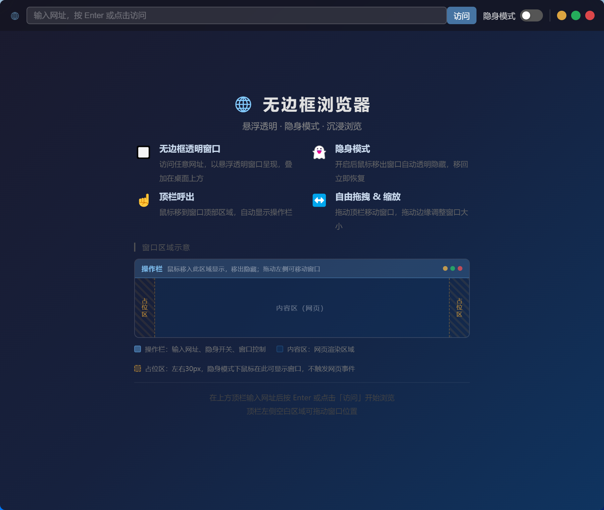

#  无边框浏览器 (Frameless Browser)

一个基于 Electron 开发的透明悬浮浏览器，支持隐身模式、多窗口管理和沉浸式浏览体验。


## 📸 界面预览



## ✨ 主要特性

- 🪟 **无边框透明窗口** - 自定义圆角窗口，支持透明背景
- 👻 **隐身模式** - 鼠标移出自动隐藏，悬浮透明
- 🎯 **多窗口支持** - 可同时打开多个浏览器窗口
- 🎨 **拖拽移动** - 顶部栏拖拽移动窗口位置
- 📺 **智能视频控制** - 隐身时自动暂停视频播放
- 🔒 **单实例模式** - 重复启动自动在现有实例中打开新窗口

## 📦 技术栈

- **Electron** 28.0.0 - 跨平台桌面应用框架
- **Webview** - 内嵌浏览器引擎
- **IPC 通信** - 主进程与渲染进程通信

## 🚀 快速开始

### 安装依赖

```bash
npm install
```

### 启动开发环境

```bash
npm start
```

应用启动后会显示一个启动页面，输入网址即可开始浏览。

## 🛠️ 二次开发

### 项目结构

```
无边框浏览器/
├── main.js                # 主进程入口文件
├── preload.js            # 主窗口预加载脚本
├── browser-preload.js    # 浏览器窗口预加载脚本
├── index.html            # 启动页面（输入网址界面）
├── browser.html          # 浏览器窗口界面
└── package.json          # 项目配置文件
```

### 核心文件说明

#### 1. main.js

主进程文件，负责：

- 创建和管理 BrowserWindow
- 处理 IPC 通信
- 实现单实例锁
- 窗口拖拽、最小化、最大化逻辑
- 隐身模式的透明度控制

#### 2. browser.html

浏览器窗口的 UI 界面，包含：

- 顶部操作栏（URL 输入框、返回/前进按钮、控制按钮）
- Webview 组件（加载网页内容）
- 隐身模式触发区域
- 窗口拖拽逻辑

#### 3. browser-preload.js

浏览器窗口的预加载脚本，暴露 API：

- `setStealthMode` - 设置隐身模式
- `dragStart/dragMove/dragEnd` - 窗口拖拽
- `minimizeWin/maximizeWin` - 窗口控制
- `openNewWindow` - 打开新窗口
- `onPauseVideo/onResumeVideo` - 视频控制

### 开发建议

1. **修改窗口样式**：编辑 `browser.html` 中的 CSS 样式
2. **调整透明度**：修改 `main.js` 中的 `setOpacity()` 参数
3. **添加功能按钮**：在 `browser.html` 的顶部栏添加新按钮，并在 `browser-preload.js` 中添加对应 IPC 通信
4. **修改默认窗口尺寸**：在 `main.js` 的 `createBrowserWindow()` 函数中调整 `width` 和 `height`

### 调试技巧

```javascript
// 在 main.js 中取消注释以下代码可打开开发者工具
// browserWin.webContents.openDevTools();
```

## 📦 打包发布

### 构建 Windows 安装包

```bash
npm run build
```

生成的文件位于 `dist/` 目录：

- `无边框浏览器 Setup 1.0.0.exe` - NSIS 安装程序

### 构建便携版

```bash
npm run build:portable
```

生成的文件：

- `dist/无边框浏览器 1.0.0.exe` - 绿色便携版（无需安装）

### 构建产物说明

| 文件类型    | 说明                     | 适用场景           |
| ----------- | ------------------------ | ------------------ |
| NSIS 安装包 | 完整的安装程序，支持卸载 | 需要正式安装的用户 |
| 便携版      | 单文件可执行程序         | 绿色软件，无需安装 |

### 修改打包配置

编辑 `package.json` 中的 `build` 字段：

```json
{
  "build": {
    "appId": "com.frameless.browser", // 应用 ID
    "productName": "无边框浏览器", // 产品名称
    "copyright": "Copyright © 2026", // 版权信息
    "directories": {
      "output": "dist" // 输出目录
    }
  }
}
```

## 📖 使用方法


### 基础使用

1. **启动应用** - 双击运行或从命令行执行 `npm start`
2. **输入网址** - 在启动页面输入要访问的网址（如 `baidu.com`）
3. **点击访问** - 点击"访问"按钮打开浏览器窗口

### 隐身模式

1. **开启隐身模式** - 将鼠标移动到窗口上半部分，点击"隐身模式"开关
2. **自动透明** - 开启后，鼠标移出窗口时自动变为半透明
3. **恢复显示** - 鼠标重新移入窗口时恢复正常显示

### 窗口操作

- **拖动窗口** - 鼠标移到顶部标题栏区域，拖拽即可移动
- **调整大小** - 拖拽窗口边缘调整尺寸
- **最小化** - 点击顶部栏的 `_` 按钮
- **最大化/还原** - 点击顶部栏的 `□` 按钮
- **关闭窗口** - 点击顶部栏的 `×` 按钮

### 多窗口使用

- **打开新窗口** - 点击顶部栏的 `+` 按钮
- **链接新窗口** - 网页中的新标签页链接会自动在新窗口打开
- **重复启动** - 再次运行程序会在现有实例中打开新窗口

### 浏览器功能

- **前进/后退** - 使用顶部栏的 `←` `→` 按钮
- **刷新页面** - 使用顶部栏的 `⟳` 按钮
- **地址栏** - 在 URL 输入框输入新地址后按回车

## ⚙️ 配置说明

### 窗口配置

在 `main.js` 中可修改默认窗口参数：

```javascript
const browserWin = new BrowserWindow({
  width: 900, // 默认宽度
  height: 760, // 默认高度
  minWidth: 250, // 最小宽度
  minHeight: 180, // 最小高度
  frame: false, // 无边框
  transparent: true, // 透明背景
  resizable: true, // 可调整大小
});
```

### 样式配置

修改 `browser.html` 中的 CSS 变量自定义样式：

```css
#top-bar {
  background: rgba(20, 20, 30, 0.72); /* 顶栏背景色 */
  backdrop-filter: blur(12px); /* 毛玻璃效果 */
  border-radius: 8px 8px 0 0; /* 圆角半径 */
}
```

## 🔧 常见问题

### 1. 窗口无法拖动

确保鼠标位于顶部标题区域（显示 "无边框浏览器" 文字的位置）。

### 2. 视频播放异常

隐身模式开启时，移出窗口会自动暂停视频播放，这是设计行为。可关闭隐身模式解决。

### 3. 打包后体积较大

这是 Electron 应用的正常现象，因为包含了完整的 Chromium 内核。可通过以下方式优化：

- 使用 `asar` 打包资源
- 排除不必要的依赖
- 使用 `electron-builder` 的压缩选项

### 4. 窗口透明度无法调整

透明度由隐身模式控制，在 `main.js` 中搜索 `setOpacity()` 方法进行修改。

## 📝 开发计划

- [ ] 添加书签功能
- [ ] 支持历史记录
- [ ] 添加下载管理器
- [ ] 支持扩展插件
- [ ] 多标签页模式
- [ ] 主题自定义

## 🤝 贡献指南

欢迎提交 Issue 和 Pull Request！

1. Fork 本仓库
2. 创建特性分支 (`git checkout -b feature/AmazingFeature`)
3. 提交更改 (`git commit -m 'Add some AmazingFeature'`)
4. 推送到分支 (`git push origin feature/AmazingFeature`)
5. 提交 Pull Request

## 📄 许可证

本项目采用 MIT 许可证 - 详见 [LICENSE](LICENSE) 文件

## 👨‍💻 作者

如有问题或建议，欢迎联系！

---

⭐️ 如果这个项目对你有帮助，请给个 Star 支持一下！
